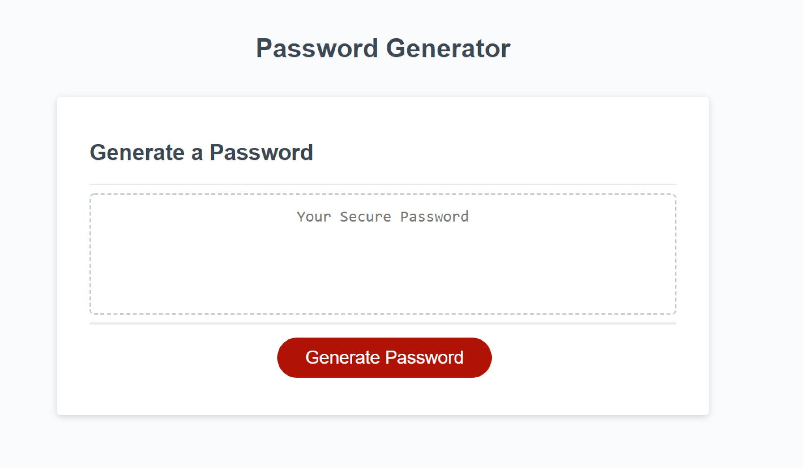

# configurable-password-generator

## Description 

Generates randomized password text at specified length, including specified character types (upper case, lower case, numeric, and/or special characters). Password length must be between 8 and 128 characters. Random string values are generated using javascript's math.random and math.floor.

If password length submitted by user is below the required character minimum, or above the maximum, the minimum or maximum value will be used to handle each invalid response case, respectively.

If the user does not confirm at least one of the four character types, all four character types will be included as possibilities. 

## Table of Contents

  - [configurable-password-generator](#configurable-password-generator)
  - [Description](#description)
  - [Table of Contents](#table-of-contents)
  - [Examples](#examples)
  - [Screenshots](#screenshots)
  - [License](#license) 

## Examples
Demo is viewable here: <https://alane019.github.io/password-generator>

## Screenshots

## License

MIT License

Copyright (c) 2020 Adam Lane

Permission is hereby granted, free of charge, to any person obtaining a copy
of this software and associated documentation files (the "Software"), to deal
in the Software without restriction, including without limitation the rights
to use, copy, modify, merge, publish, distribute, sublicense, and/or sell
copies of the Software, and to permit persons to whom the Software is
furnished to do so, subject to the following conditions:

The above copyright notice and this permission notice shall be included in all
copies or substantial portions of the Software.

THE SOFTWARE IS PROVIDED "AS IS", WITHOUT WARRANTY OF ANY KIND, EXPRESS OR
IMPLIED, INCLUDING BUT NOT LIMITED TO THE WARRANTIES OF MERCHANTABILITY,
FITNESS FOR A PARTICULAR PURPOSE AND NONINFRINGEMENT. IN NO EVENT SHALL THE
AUTHORS OR COPYRIGHT HOLDERS BE LIABLE FOR ANY CLAIM, DAMAGES OR OTHER
LIABILITY, WHETHER IN AN ACTION OF CONTRACT, TORT OR OTHERWISE, ARISING FROM,
OUT OF OR IN CONNECTION WITH THE SOFTWARE OR THE USE OR OTHER DEALINGS IN THE
SOFTWARE.
